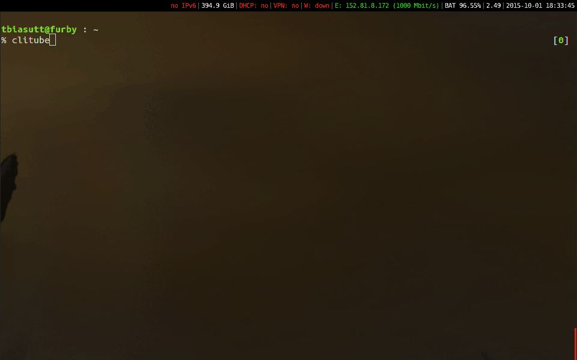

# CLITube

A curses-based interface to browse YouTube, with vi-like keybindings.  
Powered by [mplayer](http://www.mplayerhq.hu/) and [youtube-dl](https://rg3.github.io/youtube-dl/).

WORK IN PROGRESS, USE AT YOUR OWN RISK



### Installation

```bash
git clone https://github.com/NiZiL/clitube.git
cd clitube
sudo make install
```

### Key-bindings

| Key   | Action | 
|-------|--------|
| :     | enter a command |
| /     | shortcut for the search command |
| n     | load more result |
| j     | move down in the result list |
| k     | move up in the result list |
| G     | go at the last result |
| g     | go at the first result |
| SPACE | select/unselect result at current position |
| ENTER | add selected results into the playlist. If no results are selected, add result at current position |


### Commands

| Command | Effect |
|---------|--------|
| search  | search on Youtube |
| quit (q)| quit |
| next (n)| next soundtrack on the playlist |
| previous (p) | previous soundtrack on the playlist |

